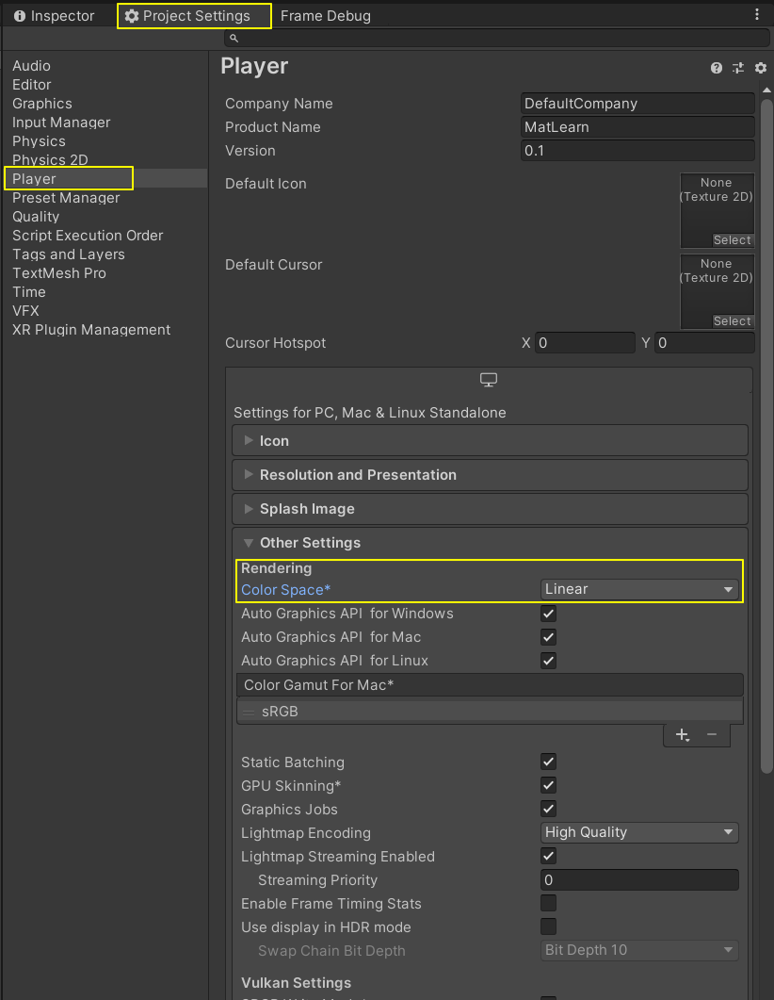
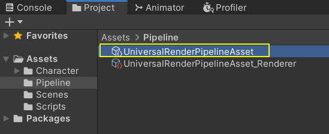
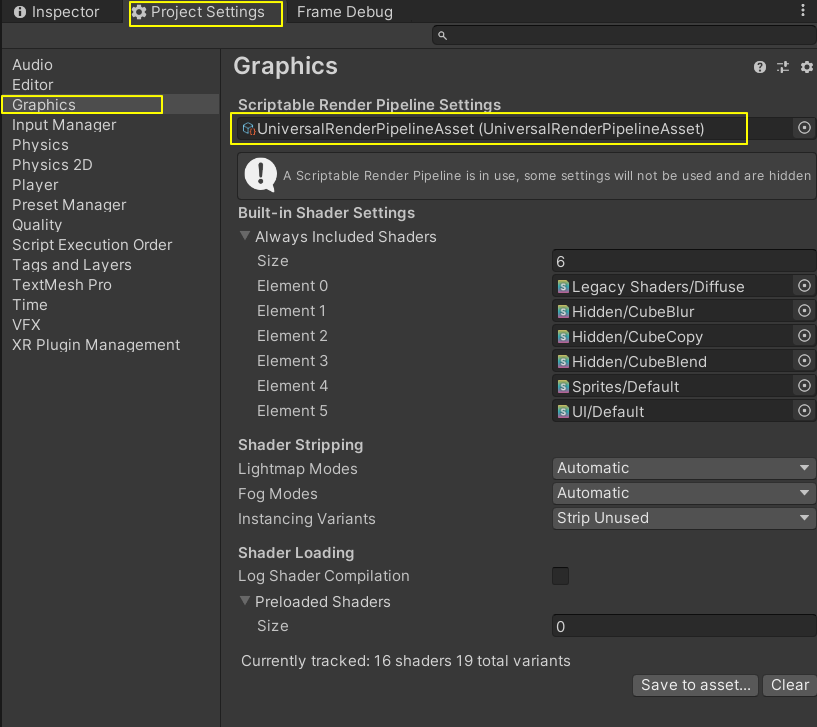
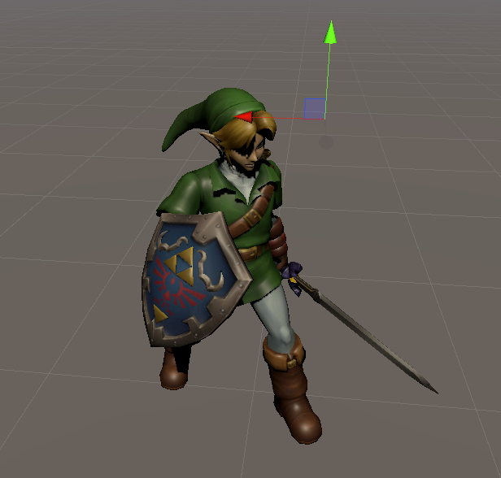
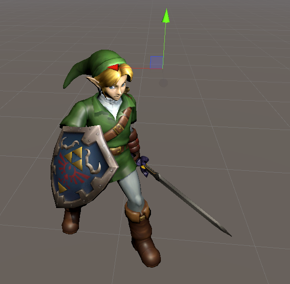
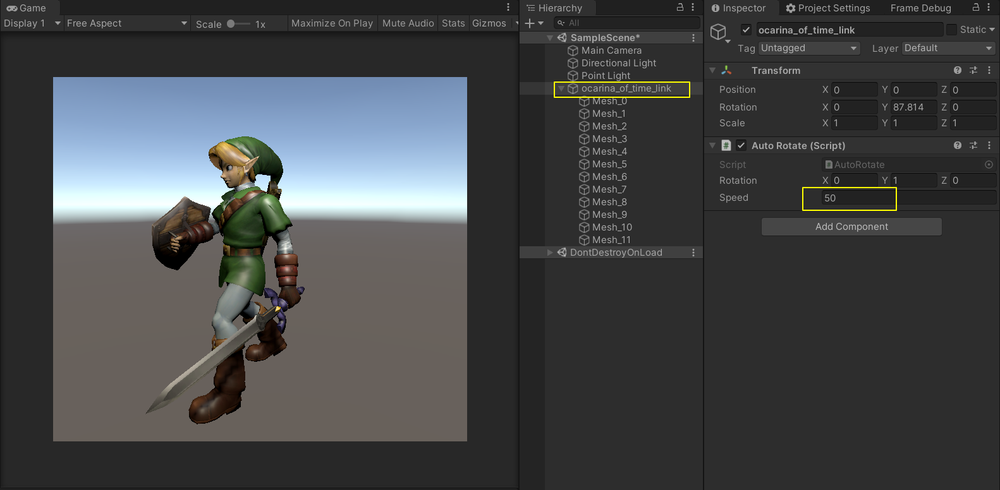
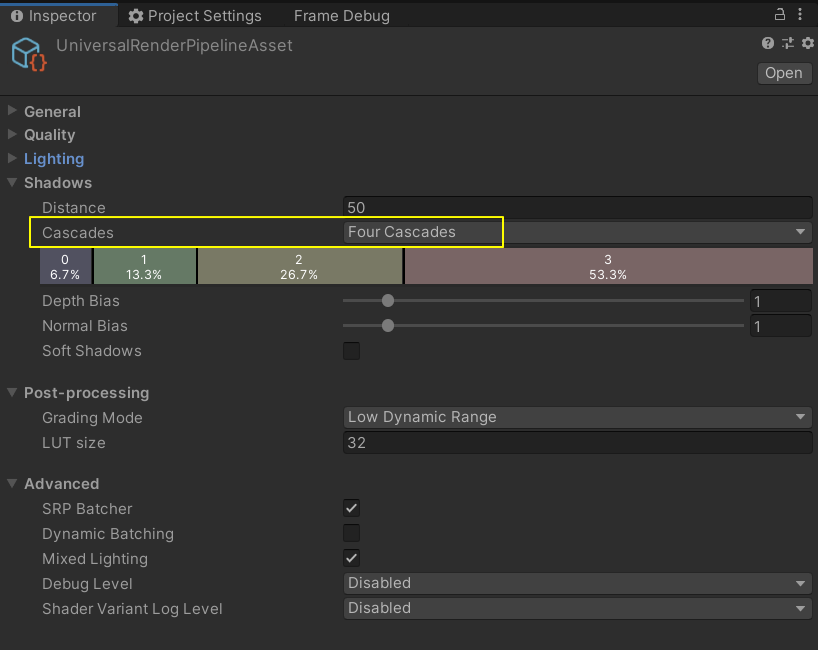
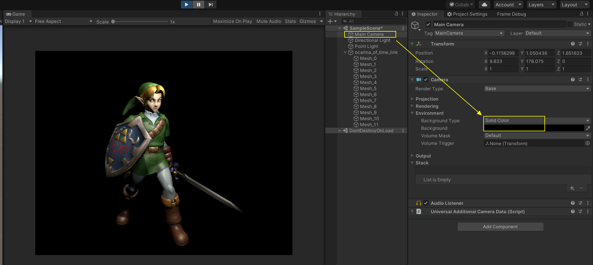

### 0. Unity版本选择

Unity2019.4.10f1，2019.2.x或者2019.3.x应该都可以。

### 1. Package 安装

###  

### 2. 设置线性空间

### 3. 创建并设置PipelineAsset

**Assets** > **Create** > **Rendering** > **Universal Render Pipeline** > **Pipeline Asset (Forward Renderer)**

### 4. 模型导入

- 把**美术资源**下的**ocarina_of_time_link**目录拷贝到工程目录。
- 拖拽ocarina_of_time_link.fbx到场景中。
- 默认的平行光比较暗，在头顶附近加一个点光。

### 5. 角色旋转

### 6. 阴影级联

如果旋转速度比较快，比如在50左右，那么可以看到阴影晃得比较快，开启ShadowCascades，可以明显缓解。在PipelineAsset上进行设置，开启Four Cascades。

### 7. 设置Camera的背景颜色

### 

### 8. 示例场景

Assets/Scenes/UrpSetUp.unity

