### 0. 预备

完成URP环境搭建。

### 1. 查看默认材质球

这个模型导入的时候，自带了材质球。看Mesh Renderer中的材质球实际上是来自FBX的。

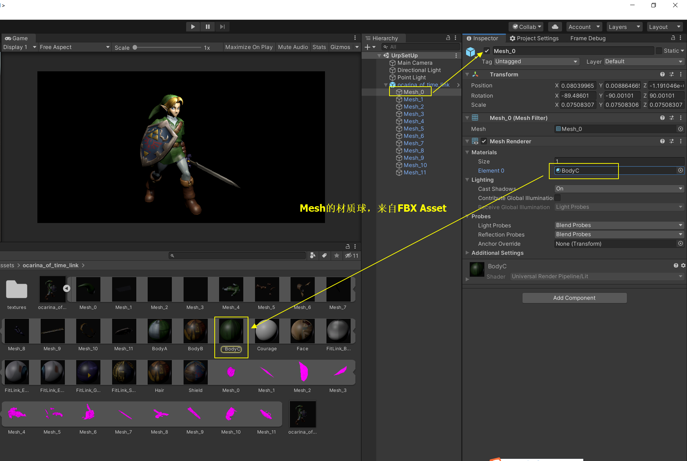

Unity创建了一个Pipeline Lit的材质球，来读取FBX中的材质，并且做好了贴图关联。

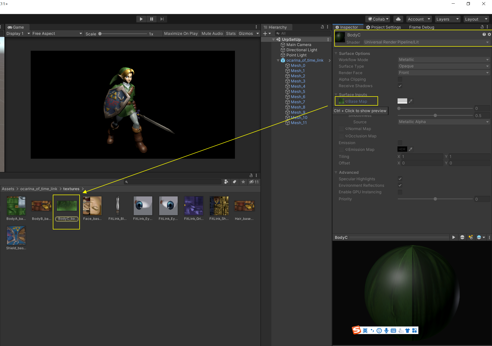

### 2. 多个材质球

- 这样做的目的是为了在游戏内定制参数，比如：我们想把长剑材质球的光滑度调高。
- 通过观察发现，FBX里面的材质球比较全，我们可以直接从其中抽取材质球。
- 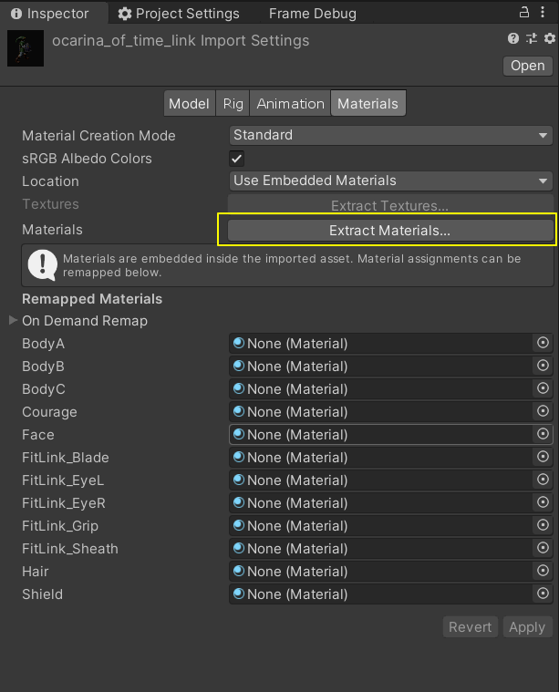

- 抽取后，会自动生成这些材质球资产，FBX上面也会自动关联这些材质球。
- 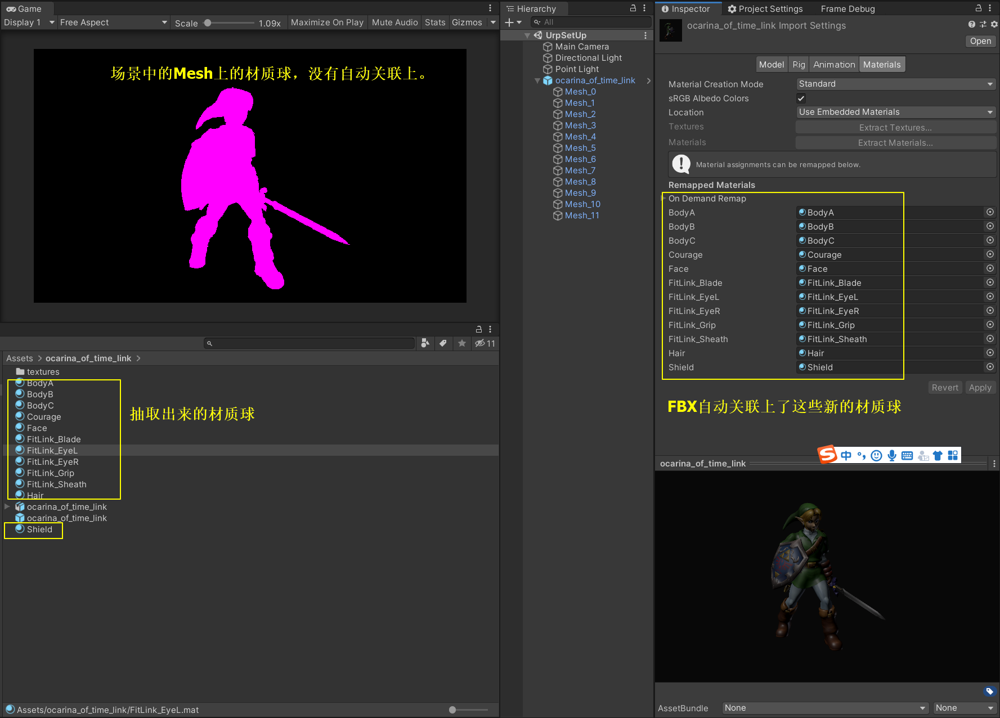

下面把材质球手动替换上

- Mesh0, BodyC, 帽子
- Mesh1, Courage, 手背上的一个片
- Mesh2, FitLink_EyeL, 左眼
- Mesh3, FitLink_EyeR, 右眼 
- Mesh4, BodyA, 身体主体
- Mesh5, BodyB, 手和脚
- Mesh6, Face, 脸
- Mesh7, FitLink_Blade, 剑身
- Mesh8, FitLink_Grip, 剑柄
- Mesh9, FitLink_Sheath, 剑鞘
- Mesh10, Hair, 头发
- Mesh11, Shield, 盾牌

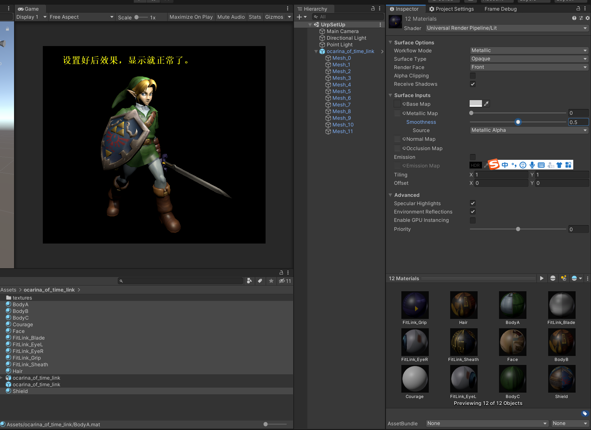

 默认材质球的光滑度都是0.5，下面修改为0，看效果，整体光滑度消失了。

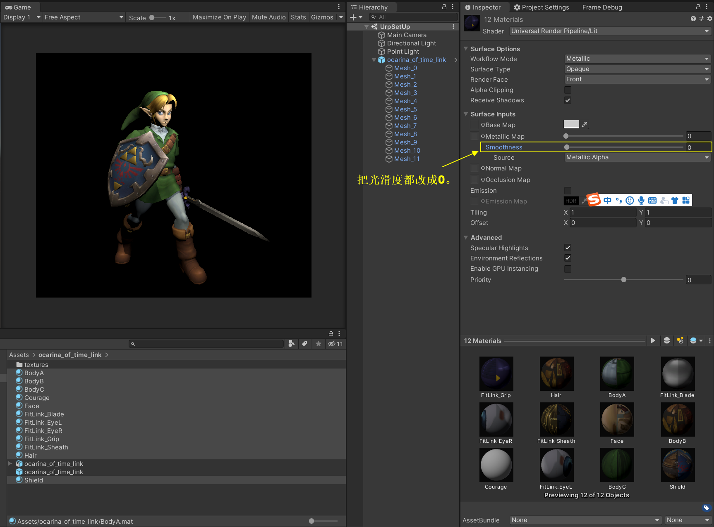

把点光源关上，效果光滑度的参数表现更明显。

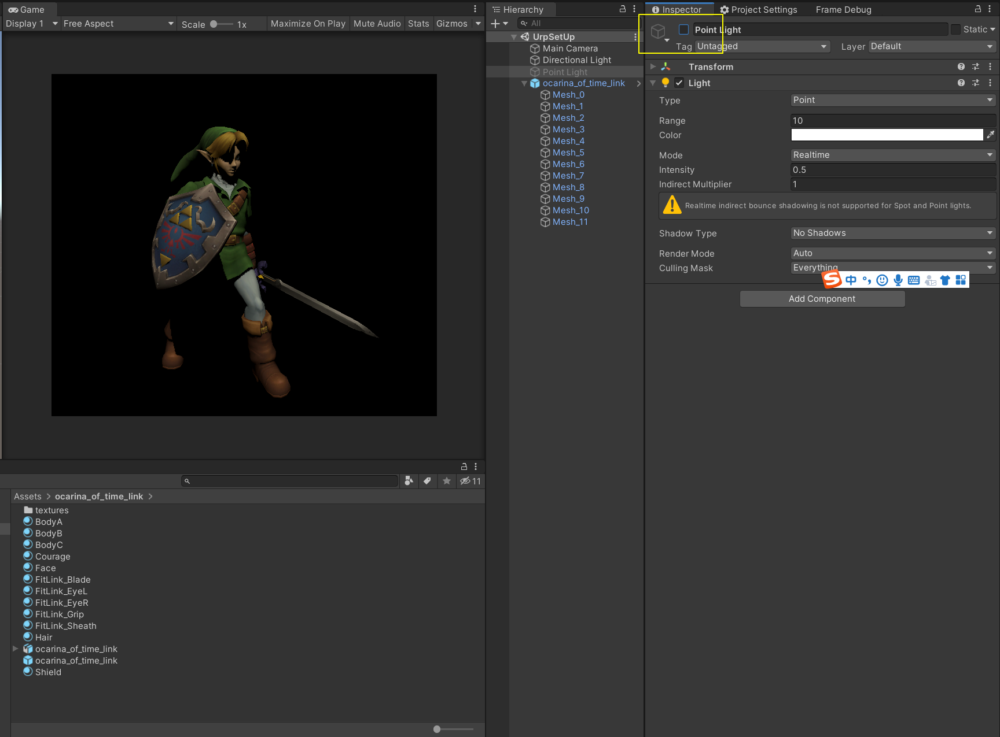

### 3. 一个材质球

上面这些材质球使用的Shader都是一样的，只是贴图数据不同，可能光滑度也需要不同。

下面通过材质球+MaterialPropertyBlock来实现。

- 创建一个player.mat材质球，把这个材质球设置到所有的MeshRenderer上。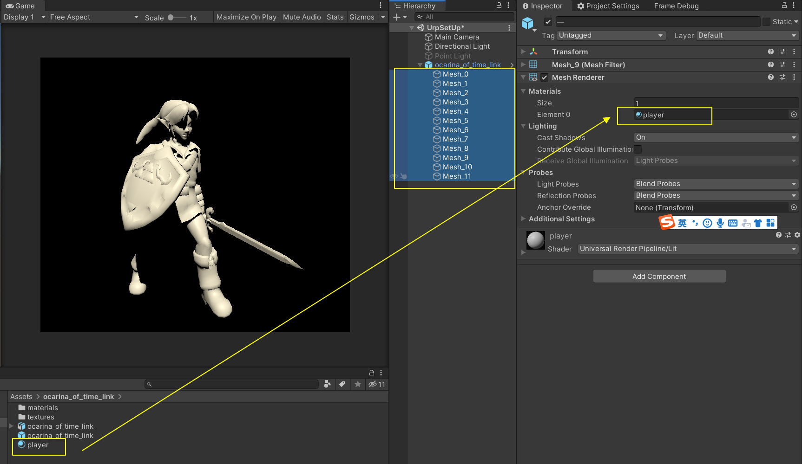

- 创建一个脚本来记录参数

```c#
using System;
using System.Collections;
using System.Collections.Generic;
using UnityEngine;

public class OcarinaMatCtrl : MonoBehaviour
{
    [Serializable]
    public class MatInfo
    {
        public string desc;
        public MeshRenderer renderer;
        public Texture2D baseMap;
        public float smoothness;
    }

    [SerializeField] public MatInfo[] infos;
}

```

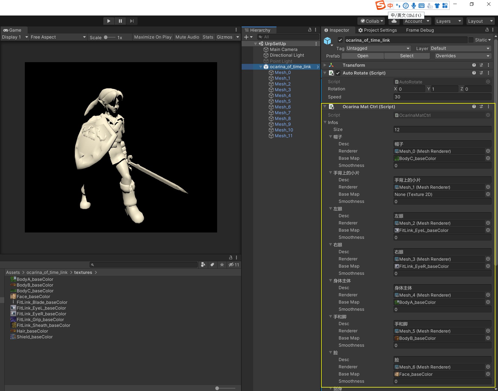

- 在脚本中增加设置参数的逻辑

  ```C#
  using System;
  using System.Collections;
  using System.Collections.Generic;
  using UnityEngine;
  
  public class OcarinaMatCtrl : MonoBehaviour
  {
      [Serializable]
      public class MatInfo
      {
          public string desc;
          public MeshRenderer renderer;
          public Texture2D baseMap;
          public float smoothness;
      }
  
      [SerializeField] public MatInfo[] infos;
      [NonSerialized] private MaterialPropertyBlock block; // 临时变量
  
      private void Update()
      {
          if(block == null)
          {
              block = new MaterialPropertyBlock();
          }
  
          Debug.Log("update");
          foreach (MatInfo info in infos)
          {
              if (info.renderer != null)
              {
                  block.Clear(); // 清空Block
                  if (info.baseMap != null)
                  {
                      block.SetTexture("_BaseMap", info.baseMap); // 设置反照率贴图
                  }
                  block.SetFloat("_Smoothness", info.smoothness); // 设置光滑度
                  info.renderer.SetPropertyBlock(block); // 设置Block
              }
          }
      }
  }
  ```

- 代码中填入的参数名字

  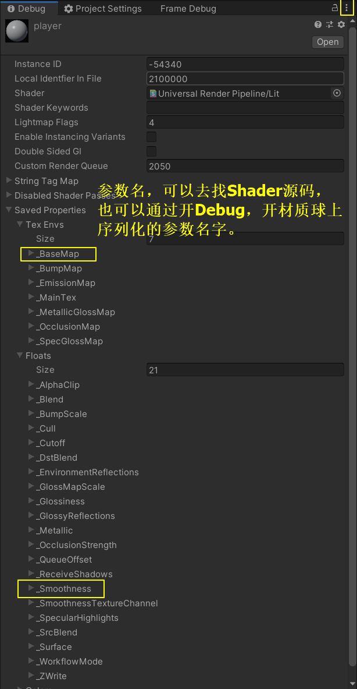

- 运行游戏

  参数起作用了。

  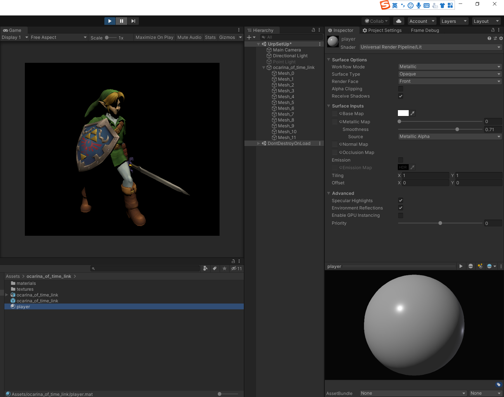

- 如果想在非运行状态下，也执行脚本，可以增加[ExecuteAlways]属性。

  ```c#
  [ExecuteAlways]
  public class OcarinaMatCtrl : MonoBehaviour
  {
      ......
  }
  ```

### 4. MeshFilter，MeshRenderer，Material，Shader

- MeshFilter：引用网格，网格来自FBX。
- MeshRenderer：引用材质球，可以是FBX内的材质球，也可以是我们创建的材质球。
- Material：引用Shader，并且序列化shader需要的具体数据。
- Shader：具体的数据定义，宏开关，顶点着色函数，像素着色函数，Blender，AlphaTest，ZTest，ZWrite等设置。

### N. 相关文章

[使用MaterialPropertyBlock来替换Material属性操作](https://blog.uwa4d.com/archives/1983.html)

